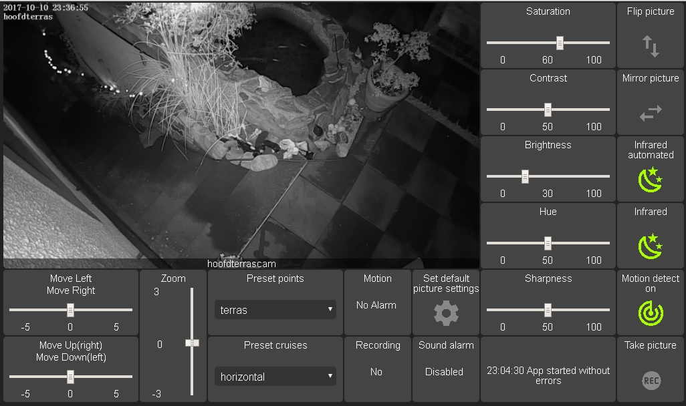
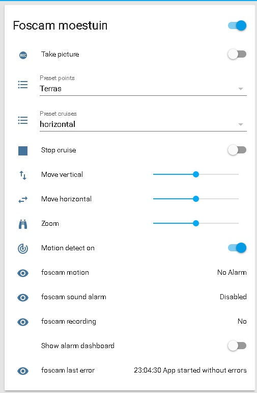
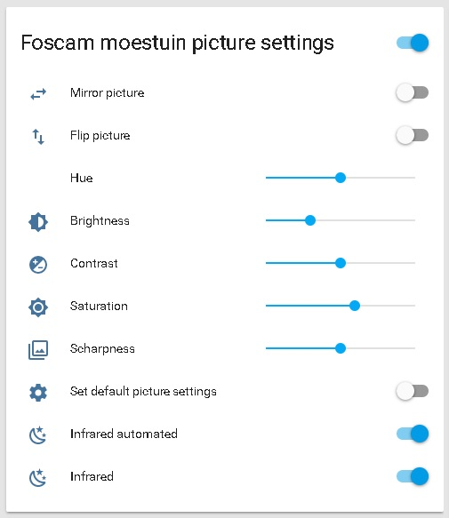

# This is an app to create controls for a foscam camera



## Cameratypes that work with this

i created 3 groups of cams that work with this app, but only group 1 has full functionality.

1) F19828P, F19828P V2, F19928P, R2, F19821W V2    
   cams that are PTZ and with infrared light 
2) C1, C1 V3    
   no PTZ cams with infrared
3) C1 lite    
   no PTZ cams without infrared
   
not all foscam cameras use the same CGI commands. there are 2 kinds of CGI. the older cams that use the old CGI are not supported by this app.   
if your cam isnt here it can still work, but i dont know the type.
to check if your cam is working with this app, give this url in your browser:

   http://CAM_IP:CAM_POORT/cgi-bin/CGIProxy.fcgi?cmd=getDevState&usr=YOUR_USER_NAME&pwd=YOUR_PWD
   
if this gives back info then you can use the app. please contact me to add the camtype.

  
## Installation

- this app can only be used with a working version from Appdaemon 3.0 or higher (for installation from appdaemon see: http://appdaemon.readthedocs.io/en/latest/index.html ) it expects at least version 3.0 .
- besides appdaemon you need to install the custom widget vertical_input_slider if you want a full working dashboard you can find them here: https://github.com/ReneTode/My-AppDaemon/tree/master/custom_widgets 
- you need to have the camera added and working in homeassistant
  https://home-assistant.io/components/camera.foscam/
- create in homeassistant the entities you can find in the file add_to_ha_configuration (input_booleans, input_selects, input_numbers and groups)

if all requirements are met you can install the app.
- download the file foscam.py and foscam.yaml and move it to your apps directory from appdaemon

```
foscam:
  class: foscam
  module: foscam                           # the name of the py file you added to your apps
  camsettings:
    camera_type: F19828P V2                # give 1 of the known camera types
    camera_name: yourcam                   # the name you gave it in home assistant
    host: 192.168.1.50                     # the ip address from your cam
    port: '88'                             # the port from your cam (default is 88)
    password: yourpassword                 # password set for the cam (no strange symbols allowed)
    user: username                         # the username you use for the cam
  logsettings:
    loglevel: WARNING                      # setting this to INFO gets more info in the log
    logsensorlevel: WARNING                # the app creates a sensor with the last info. level can be changed
    last_error_sensor: sensor.foscam_last_error # the sensor is created automaticly
  picsettings:                             # these settings need to be created in home assistant (see below)
    brightness_slider: input_number.foscam_brightness 
    contrast_slider: input_number.foscam_contrast
    hue_slider: input_number.foscam_hue
    saturation_slider: input_number.foscam_saturation
    sharpness_slider: input_number.foscam_sharpness
    default_pic_settings_switch: input_boolean.foscam_default_picture_settings
    flip_switch: input_boolean.foscam_flip
    mirror_switch: input_boolean.foscam_mirror
    auto_infrared_switch: input_boolean.foscam_auto_infrared
    infrared_switch: input_boolean.foscam_infrared
  ptzsettings:                             # these settings need to be created in home assistant (see below)
    left_right_slider: input_number.foscam_left_right
    up_down_slider: input_number.foscam_up_down
    start_cruise_select: input_select.foscam_preset_cruise
    stop_cruise_switch: input_boolean.foscam_stop_cruise
    zoom_slider: input_number.foscam_zoom
    preset_points_select: input_select.foscam_preset_points
  alarmsettings:
    motion_sensor: sensor.foscam_motion    # the sensor is created automaticly
    motion_switch: input_boolean.foscam_motion_detect # also needs to be created in home assistant
    soundalarm_sensor: sensor.foscam_sound_alarm  # the sensor is created automaticly
    sensor_update_time: '10'               # the amount of time in seconds between checks from the cam
  recordsettings:
    snap_picture_switch: input_boolean.foscam_snap_picture_now  # also needs to be created in home assistant
    recording_sensor: sensor.foscam_recording  # the sensor is created automaticly
    save_snap_dir: /home/pi/foscam_snap/   # the dir where you want manual snapshots to be saved
  dashboardsettings:
    DashboardDir: /path/to/dashboards/     # in this dir you create your dashboards                          
    use_dashboard: True                    # if this is set to False no dashboards will be created or used
    create_dashboard: True                 # creates a dashboard in your dashboard directory on initialize from the app
    create_alarm_dashboard: True           # creates an alarm dashboard
    dashboard_file_name: dash_terrascam    # the name that your dashboard gets
    alarm_dashboard_file_name: dash_terrascam_fullscreen # the name that the alarm dashboard gets
    screen_width: 1024                     # the screenwidth you want to use for your dashboard
    screen_height: 600                     # the screenheight you want to use for your dashboard
    show_full_screen_dashboard: True       # if you dont want to use the alarm dashboard set it to False
    full_screen_alarm_switch: input_boolean.foscam_toon_alarm_dash # a boolean to silence the alarmdashboard temperary
    time_between_shows: 60                 # minimum time in seconds between showing alarm dashboards
    show_time: 30                          # the amount of seconds the alarm keeps active
```


you can chose to let the app recreate the dashboard every time you start the app or when you are satisfied with the dashboard, or want to customize it, then set create_dashboard to false after the first time.

if you have done everything right you now can start your dashboard like http://your_dashboard_ip:dashboard_poort/dashboard_file_name

i welcome any feedback you can find discussion and help in this topic:
https://community.home-assistant.io/t/foscam-app-v2-appdaemon-and-hadashboard/29270

## footnotes: 
1) to make sure this app is working like you want to you need to set some settings in the foscam app, before you start this app. motion detection needs to be set to on with all settings set to how you like it. the app can then save those settings during the initialisation and reuse them every time you activate motion detection. also it is wise to set all cruisepresets and preset positions in the foscam app before you add the input_selects to home assistant. during the initialisation the app gets the following settings from your cam: motion detection settings, picture settings like brightness, contrast, etc, flip and mirrorstate, infraredstate. every 10 seconds (or the amount of time you have set in the settings) the app gets the following settings from your cam: motion detection, recording, sound detection, infrared state
2) zoom and PTZ movement are done by changing the sliders. the more you move the slider away from the center, the higher the speed. movement and zoom automaticly stops after 1 second, unless you start cruises.
3) the R2 type uses a slightly different configuration. to get it to work allright you need to edit the foscam.py
find the lines that say getMotionDetectConfig and setMotionDetectConfig and change that to getMotionDetectConfig1 and setMotionDetectConfig1
